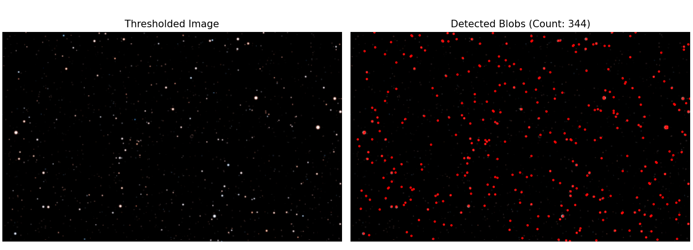

# Stars Detection in Images

This Python script detects stars from an image using the Laplacian of Gaussian method. It loads an image, applies preprocessing (grayscale conversion, Gaussian blur, and binary thresholding), and then detects blobs using `skimage.feature.blob_log`. The detected blobs are then visualized by overlaying circles on the blobs' positions.

## Requirements

- Python 3.x
- Required libraries:
  - `opencv-python` (for image processing)
  - `matplotlib` (for visualization)
  - `scikit-image` (for blob detection)

## Parameters

- **image_path**: The file path of the image to process (default: `'original.jpg'`).
- **threshold_value**: The threshold for binary thresholding (default: `50`).
- **blur_kernel_size**: The size of the Gaussian blur kernel (default: `1`).
- **max_sigma**: The maximum sigma value for blob detection (default: `30`).
- **num_sigma**: The number of sigma levels for blob detection (default: `10`).

## Usage

1. Set the path to your input image in the `image_path` variable.
2. Adjust other parameters (threshold, blur, etc.) as needed.
3. Run the script. The original image and the detected blobs will be displayed side by side.
4. The star count will be displayed on the console.

## License

This project is licensed under the MIT License - see the [LICENSE](LICENSE) file for details.
